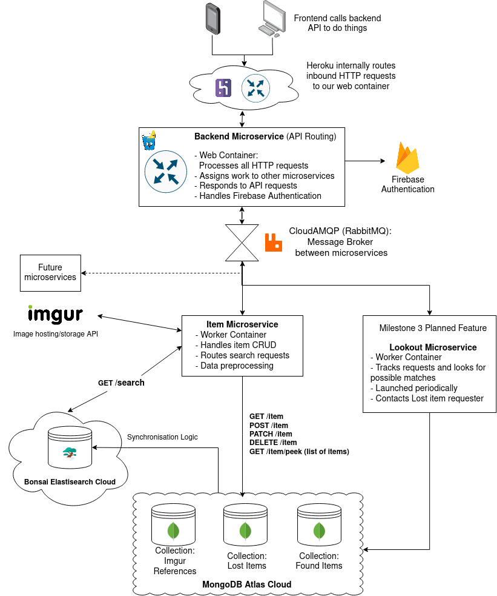

# FindNUS Backend

This README contains important primer information regarding the general project architecture, directory and dependencies for FindNUS' backend.

More information can be found within each directory's README and the docs folder.

## Architecture in a Nutshell  

This project uses a microservice architecture.  

The main microservices and their purposes are:
1. **Backend**
    Handles request routing & authentication.
2. **Item**
    Handles CRUD of items into the MongoDB database, and deals with synchronising data with the ElasticSearch provider (Bonsai).

## Microservice Implementation

Each microservice will be built as a docker container associated to a Heroku dyno.

The microservice instances will communicate with each other using message queues, vendored by RabbitMQ.

# Developer Quickstart
Want to work on a new feature or fix something? This quickstart guide is for you.  

Ensure you have the following dependencies installed:
- Golang 1.18
- Docker (if you want to build the images locally)
- git

Fork this project
`$ git clone https://github.com/FindNUS/backend` 

To work on something new, create a branch from the dev branch
`$ git checkout -b <thing>/<featureName>`
> For example, to work on a new feature that adds lost and found for *pets*, your branch should be named `feat/pets`
> 
> If you are fixing a bug, your branch should be named `fix/my_bug`

Once you are done working on your local branch, push it to the origin and submit a pull request into dev. Your code will be reviewed before being merged into dev for further testing.
`$ git push origin <thing>/<featureName>`

## CI/CD Process
This project leverages on github workflows, docker and golang's built-in testing command for CI/CD.

Once code on the dev branch is ready to be tested E2E in the cloud environent with all the bells and whistles (Database, Message Queues, etc), it will be merged with the `UAT` branch.

Our github workflow will unit-test the `dev` branch code -- and when it passes, it will be merged with the UAT branch. The workflow will execute the CD logic, building a containerised verison of the code and deploying it to Heroku.

A similar workflow is done for UAT >>> main (production).

# Project Structure & Standards
The backend structure will adhere closely to this [Golang project standards](https://github.com/golang-standards/project-layout)

## Directory :world_map: 

Lost? Start here.

### [/api](./api/README.md)  

Backend API documentation. Using OpenAPI3.0 specification. Endpoint schemas are covered here.

### /scripts

Scripts to perform build, install, testing, etc operations.

### /build

Utility scripts

### /internal

Source code for the REST logic and more. The contents will NOT be visible to other packages and projects.

# Dependencies
This section covers the major dependencies that will be used in the project.

[Gin-Gonic, a HTTP Framework](https://github.com/gin-gonic/gin)  
[MongoDB, The Data Layer](https://www.mongodb.com/)
[RabbitMQ, The Message Broker](https://github.com/streadway/amqp)
[Bonsai Elasticsearch, the ElasticSearch engine provider](https://bonsai.io/)
