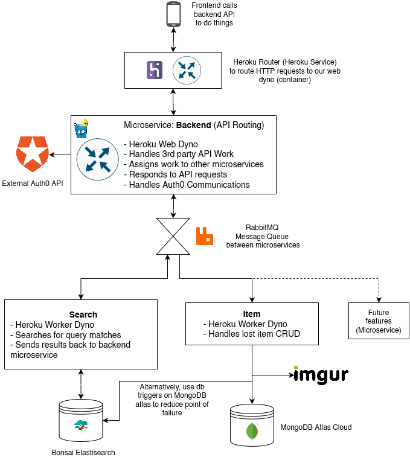

# FindNUS Backend

This README contains important primer information regarding the general project architecture, directory and dependencies for FindNUS' backend.

More information can be found within each directory's README and the docs folder.

## Architecture in a Nutshell  

This project will deploy various microservices
The HTTP router powered by Gin will handle API calls (HTTP GET POST PATCH etc) from the frontend.
Based on the API call, Gin will execute various microservices to carry out the 'business logic'.

## Microservice Implementation

Each microservice will be built as a docker container associated to a Heroku dyno.

The microservice instances will communicate with each other using message queues, vendored by RabbitMQ.

# Project Structure & Standards
The backend structure will adhere closely to this [Golang project standards](https://github.com/golang-standards/project-layout)

## Directory :map:  

Lost? Start here.

### /api  

OpenAPI specifications. Endpoint schemas will be covered here.
JSON Schema Files and Protocol Definition Files

### /scripts

Scripts to perform build, install, testing, etc operations.

### /bin

Folder to store built binaries, if any

### /build

Packaging and CI. Docker config and files live here

### /deployments

Docker images for each microservice will reside here. 

### /internal

Source code for the REST logic and more. The contents will NOT be visible to other packages and projects.

### /test

For running tests, if any.

# Dependencies
This section covers the major dependencies that will be used in the project
[Gin-Gonic, a HTTP Framework](https://github.com/gin-gonic/gin)  
[MongoDB](https://www.mongodb.com/)

